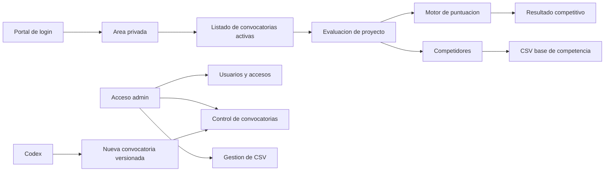

# Arquitectura inicial

## 1. Proposito

La plataforma permitira comprobar la competitividad de un proyecto frente a una convocatoria de financiacion publica.

El usuario introducira informacion basica del proyecto, respondera preguntas de evaluacion, podra anadir competidores y recibira una estimacion de posicionamiento/puntuacion respecto a una base historica o competitiva cargada desde CSV.

Este documento define el esquema inicial del producto y servira como base para evolucionar el repositorio.

## 2. Alcance inicial

Incluido en la primera arquitectura:

- Portal de acceso con usuario y contrasena.
- Pantalla privada con convocatorias activas.
- Vista de detalle de convocatoria.
- Cuestionario de evaluacion del proyecto.
- Sistema de puntuacion por convocatoria.
- Sistema para anadir competidores.
- Carga de CSV como base para estimar la competencia.
- Acceso admin para usuarios, permisos, accesos y activacion de convocatorias.
- Proceso controlado para crear nuevas convocatorias con Codex.

Fuera de alcance inicial, salvo que se decida despues:

- Registro publico abierto de usuarios.
- Pasarela de pago.
- Edicion completa de convocatorias desde interfaz grafica.
- Automatizacion de scraping externo.
- Integraciones directas con administraciones publicas.

## 3. Roles

### Usuario

Puede acceder a las convocatorias activas asignadas o visibles para su perfil. Puede crear evaluaciones de proyectos, responder cuestionarios, anadir competidores y consultar resultados.

### Administrador

Puede gestionar usuarios, accesos, visibilidad de convocatorias, estado activo/inactivo y datos base de competencia.

### Codex

Se usara como mecanismo controlado para crear o actualizar nuevas convocatorias. La convocatoria quedara definida como configuracion versionada en el repositorio, revisable antes de desplegarse.

## 4. Modulos principales



### Portal de login

Responsable de autenticar usuarios y dirigirlos a su area privada.

Elementos previstos:

- Usuario/email.
- Contrasena.
- Recuperacion de acceso: fuera de alcance en esta fase; la gestion se hara manualmente desde administracion/Codex.
- Control de sesion.

### Area privada

Pantalla posterior al login donde el usuario ve solo las convocatorias activas disponibles para el.

Elementos previstos:

- Listado de convocatorias visibles.
- Estado de cada convocatoria.
- Acceso a evaluaciones creadas.
- Acceso a crear nueva evaluacion.

### Convocatorias

Cada convocatoria tendra una estructura configurable:

- Identificador interno.
- Nombre.
- Organismo o programa.
- Estado: borrador, activa, inactiva, archivada.
- Preguntas de evaluacion.
- Reglas de puntuacion.
- Pesos o criterios.
- Requisitos minimos, si existen.
- Campos necesarios para comparar el proyecto.
- CSV o dataset competitivo asociado.

### Cuestionario de proyecto

Conjunto de preguntas basicas para determinar la puntuacion del proyecto.

Tipos de pregunta iniciales:

- Texto corto.
- Texto largo.
- Numero.
- Booleano.
- Opcion unica.
- Opcion multiple.
- Rango o escala.

Cada respuesta podra alimentar una o varias reglas de puntuacion.

### Motor de puntuacion

Responsable de transformar respuestas del cuestionario en una puntuacion estimada.

Principios iniciales:

- La puntuacion debe ser reproducible.
- Las reglas deben quedar versionadas.
- Cada criterio debe poder explicar como contribuye al resultado.
- El resultado debe separar puntuacion del proyecto y posicion relativa frente a competidores.

Resultado minimo esperado:

- Puntuacion total estimada.
- Puntuacion por bloque o criterio.
- Fortalezas.
- Debilidades.
- Comparacion frente a datos CSV.
- Nivel competitivo estimado.

### Competidores

El usuario podra anadir competidores conocidos para enriquecer la comparacion.

Datos iniciales posibles:

- Nombre del competidor.
- Tipo de entidad.
- Sector.
- Localizacion.
- Proyecto o linea de actuacion.
- Presupuesto estimado.
- Puntuacion conocida o estimada.
- Observaciones.

Los competidores introducidos por usuario deben separarse de la base CSV oficial/importada.

### CSV base de competencia

El CSV sera la base inicial para estimar la competencia.

Uso previsto:

- Cargar datos historicos o comparativos.
- Normalizar columnas a un esquema interno.
- Asociar un CSV a una convocatoria.
- Calcular percentiles, rangos, medias y referencias comparativas.

Validaciones iniciales:

- Formato de columnas requerido.
- Tipos de datos.
- Filas invalidas.
- Duplicados.
- Version del CSV.
- Fecha de carga.

### Admin

Interfaz privada para control del sistema.

Funciones iniciales:

- Crear usuarios.
- Activar/desactivar usuarios.
- Asignar roles.
- Gestionar accesos a convocatorias.
- Activar/desactivar convocatorias.
- Consultar evaluaciones.
- Cargar o sustituir CSV de competencia.
- Ver auditoria basica de acciones.

## 5. Modelo de datos inicial

Entidades candidatas:

- `User`: usuario autenticado.
- `Role`: permisos del usuario.
- `Session`: sesion activa.
- `Call`: convocatoria.
- `CallAccess`: relacion entre usuario/grupo y convocatoria.
- `Question`: pregunta de una convocatoria.
- `AnswerOption`: opciones para preguntas cerradas.
- `ScoringRule`: regla de puntuacion.
- `ProjectEvaluation`: evaluacion de un proyecto.
- `ProjectAnswer`: respuesta de usuario.
- `ScoreResult`: resultado calculado.
- `Competitor`: competidor anadido manualmente.
- `CompetitionDataset`: CSV importado.
- `CompetitionDatasetRow`: fila normalizada del CSV.
- `AuditLog`: registro de acciones relevantes.

Relaciones clave:

- Un usuario puede tener muchas evaluaciones.
- Una convocatoria puede tener muchas preguntas.
- Una convocatoria puede tener muchas reglas de puntuacion.
- Una evaluacion pertenece a un usuario y a una convocatoria.
- Una evaluacion puede tener muchos competidores manuales.
- Una convocatoria puede tener uno o varios datasets CSV versionados.

## 6. Flujo principal de usuario

1. El usuario accede al portal.
2. Introduce usuario y contrasena.
3. El sistema valida credenciales y permisos.
4. El usuario entra en el area privada.
5. El sistema muestra convocatorias activas disponibles.
6. El usuario selecciona una convocatoria.
7. El usuario crea o continua una evaluacion de proyecto.
8. El usuario responde preguntas basicas.
9. El usuario anade competidores, si aplica.
10. El sistema calcula puntuacion y comparacion competitiva.
11. El usuario revisa resultados.

## 7. Flujo admin

1. El administrador accede al portal admin.
2. Gestiona usuarios, roles y accesos.
3. Activa o desactiva convocatorias.
4. Carga CSV asociado a una convocatoria.
5. Revisa evaluaciones y auditoria basica.

## 8. Flujo para nuevas convocatorias con Codex

Las nuevas convocatorias se crearan mediante cambios versionados en el repositorio.

Proceso propuesto:

1. Se aporta documentacion de la convocatoria.
2. Codex analiza criterios, preguntas, umbrales y reglas.
3. Codex crea o actualiza la configuracion de la convocatoria.
4. Codex anade preguntas, reglas de scoring y validaciones.
5. Se revisa el cambio en GitHub.
6. Se aprueba y despliega.
7. La convocatoria queda disponible como borrador o activa segun decida admin.

Ventajas:

- Trazabilidad.
- Versionado.
- Revision antes de publicar.
- Menor riesgo de romper reglas complejas desde una UI generica.

## 9. Seguridad y permisos

Requisitos iniciales:

- Contrasenas almacenadas con hashing seguro.
- Sesiones con expiracion.
- Separacion entre usuario y administrador.
- Control de acceso por convocatoria.
- Auditoria de acciones admin.
- Validacion estricta de CSV.
- Proteccion frente a acceso no autorizado a evaluaciones de otros usuarios.

## 10. Decisiones tecnicas pendientes

Pendiente decidir:

- Framework frontend.
- Backend/API.
- Base de datos.
- Sistema de autenticacion.
- Formato de configuracion de convocatorias.
- Motor de reglas.
- Estrategia de despliegue.
- Repositorio GitHub definitivo.

Opciones razonables para una primera version:

- Aplicacion web full stack.
- Base de datos relacional.
- Configuracion de convocatorias en archivos versionados.
- Importacion CSV con validacion previa.
- Admin simple, privado y funcional.

## 11. Estructura inicial sugerida del repositorio

```text
docs/
  arquitectura.md
  decisiones.md
  roadmap.md

src/
  app/
  auth/
  admin/
  calls/
  evaluations/
  competitors/
  scoring/
  datasets/

data/
  samples/

config/
  calls/

tests/
```

## 12. Roadmap inicial

### Fase 1: Base del proyecto

- Crear repositorio GitHub.
- Elegir stack tecnico.
- Definir modelo de datos.
- Implementar login.
- Crear pantalla de convocatorias activas.

### Fase 2: Evaluaciones

- Crear estructura de convocatoria.
- Crear cuestionario.
- Implementar guardado de respuestas.
- Implementar motor basico de puntuacion.

### Fase 3: Competencia

- Definir formato CSV.
- Implementar carga y validacion.
- Crear comparativa basica.
- Permitir competidores manuales.

### Fase 4: Admin

- Gestion de usuarios.
- Gestion de accesos.
- Activacion/desactivacion de convocatorias.
- Carga de CSV.
- Auditoria basica.

### Fase 5: Convocatorias con Codex

- Definir plantilla de convocatoria.
- Crear primera convocatoria real.
- Crear tests de reglas.
- Revisar flujo GitHub.

## 13. Estado GitHub

El proyecto esta preparado para montarse en GitHub, pero falta definir o conectar el repositorio remoto.

Acciones necesarias:

- Confirmar cuenta u organizacion GitHub.
- Crear repositorio remoto.
- Conectar `origin`.
- Autenticar GitHub CLI o usar conector GitHub valido.
- Crear primera rama de trabajo.
- Publicar el documento de arquitectura.
